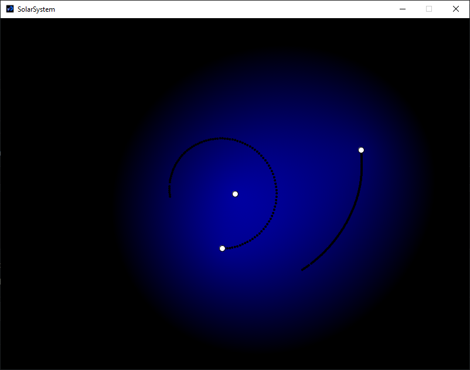

# SolarSystemSim
A small simulation of gravity made in Processing:

This is very small simulation I made a while ago. It simulates two planets orbiting another one. (Pretty much like the solar system)

It also draws in the background, the force of gravity at that point, which makes it easier to visualize how the gravitational field
changes when the planets move.
